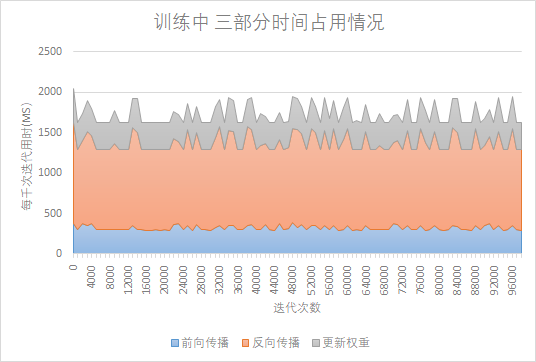
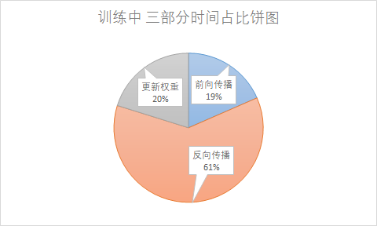
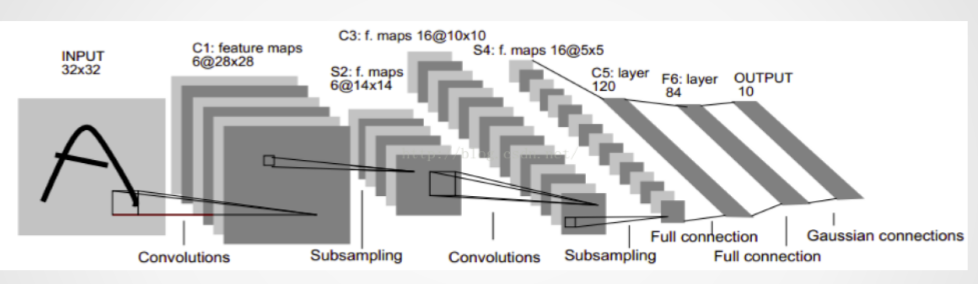
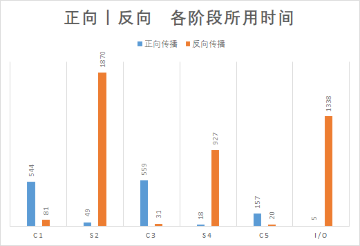
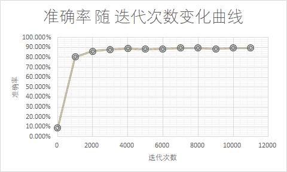
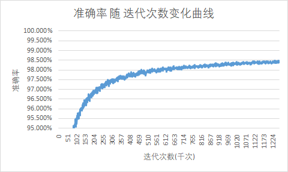
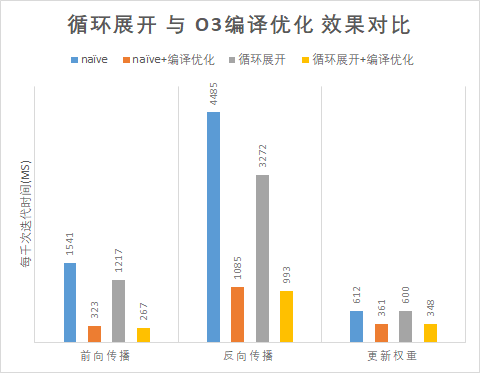
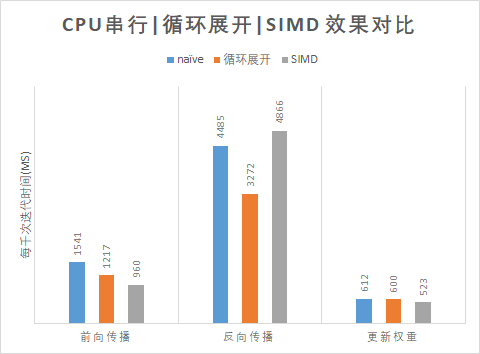
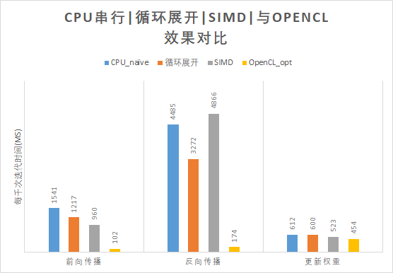

# Quick Start

一步构建:

```
make
```

运行特定程序:

```bash
./0_CPU_naive		# 运行CPU串行程序训练过程
./1_CPU_loop_opt	# 运行经循环优化的训练过程
./2_CPU_SIMD		# 运行经SIMD指令优化的训练过程
./3_GPU_naive		# 运行只有正向传播经OpenCL优化的训练过程
./4_GPU_opt			# 运行正向和反向传播都经过OpenCL优化的训练过程
```

只保留源码:

```
make clean
```

# 目录结构

```bash
├── 0_CPU_naive		# make 编译得到的可执行文件
├── ....   
├── Include.mk		# 用户设定OpenCL目录\编译器参数等信息
├── Makefile		# 根目录Makefile 一步编译所有模型
└── src
    ├── 0_CPU_naive	# 多个不同的训练程序
    │   ├── ....
    │   └── Makefile# 每个训练程序有单独Makefile
    │     
    ├── 1_CPU_loop_opt
    │   ├── ....
    │   └── Makefile
    │   ....  
    │   .... 
```

# 实验

## 设备环境

CPU:	Ryzen 1700X   3.4 GHz   8核16线程

RAM: 	16GB

GPU:	GTX1070    8GB RAM    1920 CUDA Core

系统:    Ubuntu 18.04.4

编译器:  gcc 7.5.0 编译使用 `-O0` 关闭优化

## 结果展示

### Profiling




* 可以发现三部分各自所用时间并**不会**随着迭代次数的增加有大幅度变化, 三部分占比**基本是稳定的**.

  

* 总体来看**反向传播**占用了绝大多数时间


#### 具体来看每一层所用时间





* 可以发现正向传播主要时间花费在 **卷积层**
* 反向传播主要时间花费在 **池化层**


#### 再来看收敛速度



* 前2千次迭代快速将准确率提升到 **85%** 之后缓慢上升



* 之后在1000 千次迭代后基本收敛在 **98.5%**


#### 对比 循环展开 与 编译器自带优化 的效果



* 辛苦展开半天 性能提升了 **30%**
* 一键开启O3编译优化 性能提升 **300**%


#### SIMD的优化效果



* 在关闭编译器优化的情况下 **正向传播正优化 反向传播反优化 **


#### 使用OpenCL



* **一个数量级**的性能提升

